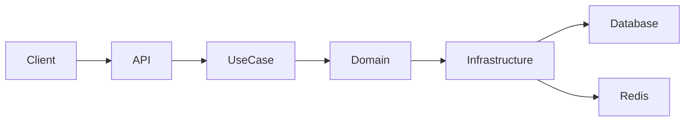
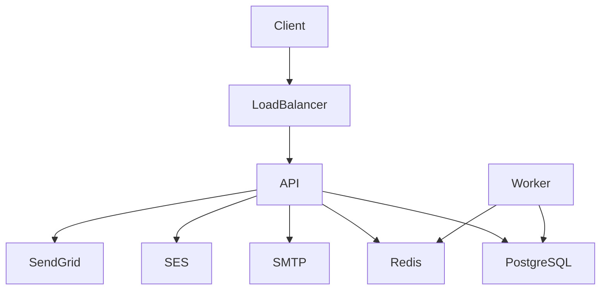

# SendFlix — Production-Grade Email Delivery Platform

[]()
[]()
[]()
[]()
[]()

A production-ready, enterprise-grade email delivery platform built with **Go**, following **Domain-Driven Design (DDD)** and **Clean Architecture** principles.

SendFlix provides scalable, reliable, and provider-agnostic email delivery with support for SMTP, AWS SES, and SendGrid.

---

# Table of Contents

- [Overview](#-overview)
- [Features](#-features)
- [Architecture](#-architecture)
- [Project Structure](#-project-structure)
- [Tech Stack](#-tech-stack)
- [Getting Started](#-getting-started)
- [Configuration](#-configuration)
- [Running the Application](#-running-the-application)
- [Docker Deployment](#-docker-deployment)
- [API Documentation](#-api-documentation)
- [System Architecture](#-system-architecture)
- [Production Deployment](#-production-deployment)
- [Contributing](#-contributing)
- [License](#-license)

---

# Overview

SendFlix is a scalable email delivery system designed for production workloads.  
It provides reliable email sending, template management, scheduling, retries, and provider switching.

The system is built for:

- High performance
- Scalability
- Reliability
- Infrastructure independence
- Clean system design

---

# Features

## Email Delivery
- Send transactional emails
- Bulk email sending
- Scheduled delivery
- Retry mechanism
- Delivery status tracking

## Template Management
- Template creation and updates
- Template preview
- Template activation
- Dynamic rendering

## Performance
- Redis caching
- Background workers
- Connection pooling
- Horizontal scalability

## Provider Support
- SMTP
- AWS SES
- SendGrid
- Provider abstraction layer

## Architecture
- Domain-Driven Design
- Clean Architecture
- Infrastructure independence
- Highly testable components

---

# Architecture

SendFlix follows **DDD + Clean Architecture**.

```
Delivery → Use Case → Domain
Infrastructure → Domain
```

## Layers

| Layer | Responsibility |
|---|---|
| Domain | Core business logic |
| Use Case | Application workflows |
| Infrastructure | External integrations |
| Delivery | APIs and interfaces |
| Worker | Background processing |

---

# Project Structure

```text
sendflix/
├── cmd/                # Application entry points
├── internal/           # Core application logic
│   ├── domain/         # Business entities
│   ├── usecase/        # Application logic
│   ├── infrastructure/ # External implementations
│   ├── delivery/       # HTTP / gRPC / CLI
│   └── worker/         # Background jobs
├── pkg/                # Shared packages
├── api/                # Protobuf definitions
├── migrations/         # Database migrations
├── docker/             # Docker setup
```

---

# Tech Stack

| Category | Technology |
|---|---|
| Language | Go |
| Database | PostgreSQL |
| Cache | Redis |
| Transport | HTTP / gRPC |
| Containerization | Docker |
| Architecture | DDD + Clean Architecture |
| Email Providers | SMTP / AWS SES / SendGrid |

---

# Getting Started

## Prerequisites

- Go 1.22+
- Docker
- PostgreSQL
- Redis

---

## Clone Repository

```bash
git clone https://github.com/yourusername/sendflix.git
cd sendflix
```

---

## Install Dependencies

```bash
go mod tidy
```

---

# Configuration

Configuration files are located in:

```
config/
```

Example:

```yaml
server:
  port: 8080

database:
  host: localhost
  port: 5432
  user: postgres
  password: postgres

redis:
  host: localhost
  port: 6379
```

---

# Running the Application

## Start API Server

```bash
go run cmd/api/main.go
```

## Start gRPC Server

```bash
go run cmd/grpc/main.go
```

## Start Worker

```bash
go run internal/worker/scheduler.go
```

---

# Docker Deployment

## Build Containers

```bash
docker compose build
```

## Start Services

```bash
docker compose up
```

---

# API Documentation

## Send Email

```
POST /emails/send
```

### Request

```json
{
  "to": "user@example.com",
  "subject": "Welcome",
  "template": "welcome"
}
```

---

## Create Template

```
POST /templates
```

---

# System Architecture



---

# Production Deployment



---

# Contributing

Contributions are welcome.

## Steps

1. Fork repository
2. Create feature branch
3. Commit changes
4. Open pull request

---

# License

This project is licensed under the MIT License.
